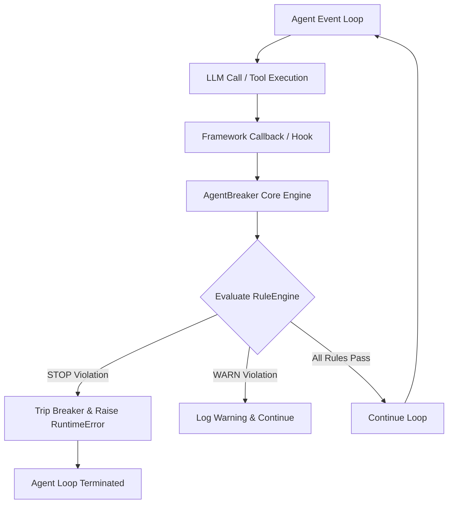

# How It Works

AgentBreaker acts as an active guardrail at the orchestration layer of your AI agents. Unlike logging tools that audit runs after they finish, AgentBreaker runs inline after every step to intercept and terminate runaway loops before they exceed safety budgets.

---

## The Inline Interceptor Architecture

Instead of intercepting HTTP requests at the proxy level or using complex monkey-patching, AgentBreaker integrates directly into your agent's event loop via standard framework interfaces (such as LangChain Callbacks or OpenAI Agents RunHooks).

---

## Step-by-Step Operation

After each LLM call or tool execution, the callback handler delegates tracking to the core engine:

1. **State Aggregation**: Updates cumulative metrics on the active `RunState` object:
   * Increments `iteration_count`
   * Computes dollar cost based on token prices (e.g. input/output costs) and updates `total_cost_usd`
   * Registers elapsed time relative to `start_time`
   * Appends token counts and tool call details (name + argument fingerprints)
2. **Rule Evaluation**: Passes `RunState` and rule configurations to the `RuleEngine`. Every registered rule is evaluated in sequence:
   * **STOP rules** (e.g., `cost_exceeded`, `repeated_tool_calls`): Return immediately on first violation.
   * **WARN rules** (e.g., `circling_loop`, `output_bloat`): Are collected and flagged to the dashboard/logs but do not raise an exception.
3. **Execution Interruption**: If any STOP rule is violated:
   * The breaker state is marked `is_tripped = True`.
   * A `RuntimeError` is raised with a descriptive message outlining exactly which safety rule was triggered.
   * The exception bubbles up through the framework, terminating the runaway loop instantly.

---

## Cost Savings Calculator

When a breaker trips, AgentBreaker calculates the **estimated savings** by comparing the actual cost of the run against what it would have cost if the agent had continued looping up to its maximum iterations:

$$\text{Savings} = \left( \frac{\text{Actual Cost}}{\text{Current Iteration}} \times \text{Max Iterations} \right) - \text{Actual Cost}$$

This estimation is logged to the backend database and rendered on the live dashboard so teams can track exactly how much API budget the breaker is saving.
